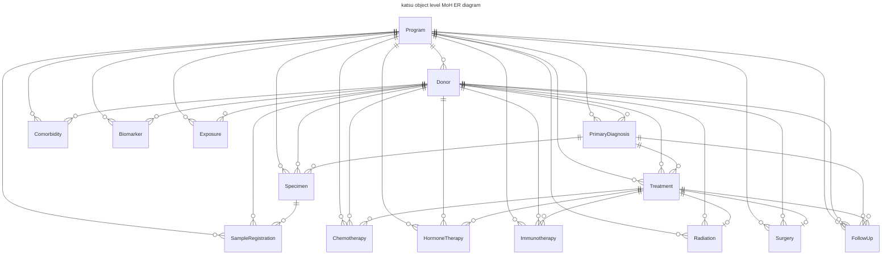
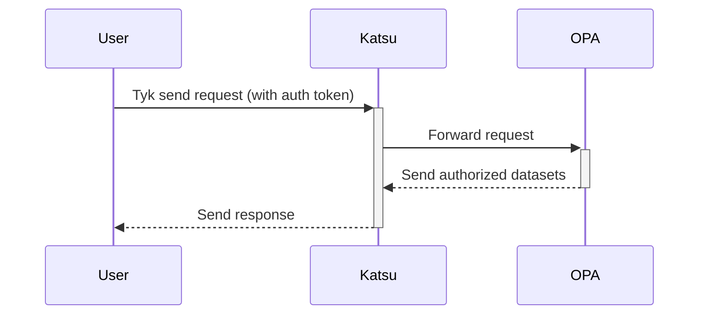
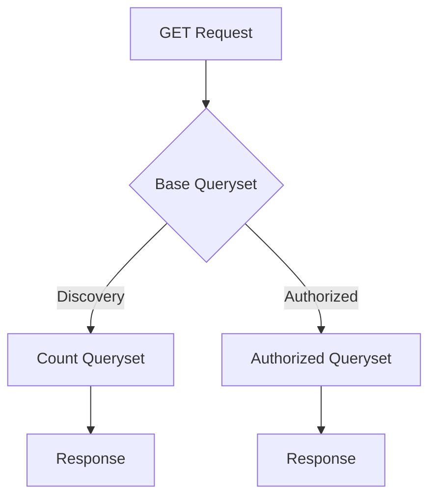

# Katsu Marathon of Hope (MoH) Packets


[](https://codecov.io/gh/CanDIG/katsu)

## Table of Contents

- [Installation Guide](#installation-guide) <!-- omit in toc -->
- [Tests](#tests)
- [Data Model](#mohccn-clinical-data-model)
- [Authentication and Authorization](#authentication-and-authorization)
- [REST API](#rest-api)

## Installation Guide

This guide will walk you through the steps to install and run Katsu on your local machine.

NOTE: If you want to run as docker container, please refer to the [docker guide](https://github.com/CanDIG/CanDIGv2/blob/develop/docs/install-docker.md)

### Prerequisites

Before you start, make sure you have the following installed on your machine:

- Python 3.8 or later
- PostgreSQL

### Step 1: Clone the repository

First, clone the repository to the folder where you want to install:

```bash
git clone https://github.com/CanDIG/katsu.git
```

### Step 2: Create a virtual environment (optional)

It's a good idea to create a virtual environment for your Django project, to keep your dependencies separate from other Python projects on your machine:

```bash
# Linux
sudo apt-get install python3-venv    # If needed
python3 -m venv .venv
source .venv/bin/activate

# macOS
python3 -m venv .venv
source .venv/bin/activate

# Windows
py -3 -m venv .venv
.venv\scripts\activate
```

### Step 3: Install dependencies

With your virtual environment activated, navigate to the project directory and install the project dependencies:

```bash
pip install -r requirements/dev.txt
```

This will install all the packages needed for development.

### Step 4: Set up PostgreSQL

Replace "dbname", "username", and "password" with the values in [local.py](config/settings/local.py):

```sql
sudo -u postgres psql
CREATE DATABASE dbname;
CREATE USER username WITH PASSWORD 'password';
GRANT ALL PRIVILEGES ON DATABASE dbname TO username;
```

### Step 5: Set up database

With the database configured, run the following command to create the necessary database tables:

```bash
python manage.py migrate
```

### Step 6: Run development server

Start the server with the following command:

```bash
python manage.py runserver
```

This will start the development server on port 8000. You can access the server by opening a web browser and navigating to <http://localhost:8000>

### Step 7: Ingest some data (optional)

Mock data are available [here](chord_metadata_service/mohpackets/data/README.md)

## Tests

Run all tests and linting checks for the whole project:

```bash
tox
```

Run all tests for mohpackets:

```bash
python manage.py test chord_metadata_service.mohpackets
```

Run each test:

```bash
python manage.py test chord_metadata_service.mohpackets.tests.<test_name>
```

Test and create `coverage` HTML report:

```bash
tox
coverage html
```

## MOHCCN Clinical Data Model

Katsu uses an underlying data model that is a compatible interpretation, but does not exactly match the MOHCCN data model. Katsu is currently compliant with version 2 of the model, released February 2023. Some relationships between objects have been modified to avoid excessive complexity in the katsu database and allow for the submission of data that is incomplete compared to the MOHCCN gold standard requirements. Permissable values for controlled fields are not validated by the underlying database.

The katsu MoH model is explicitly defined as a set of classes in [models.py](chord_metadata_service/mohpackets/models.py). Permissable values for controlled fields, conditionally required fields and relationships are enforced by the [serializers](chord_metadata_service/mohpackets), [clinical ETL](https://github.com/CanDIG/clinical_ETL_code) and [ingest](https://github.com/CanDIG/candigv2-ingest) validation steps.

An overview diagram of how objects in the katsu model is shown below. A more detailed entity relationship diagram containing field level information can be found in the [mohpackets docs folder](chord_metadata_service/mohpackets/docs/er_diagram.md)


### General notes

* The primary key for **Program** is `program_id` and should be unique across all instances of the CanDIG platform
* For all other objects, the primary key is the `submitter_<object_name>_id`, a user provided identifier that should be unique across all instances of an object within a program
* All objects are explicitly linked with foreign keys to a **Program** and the **Donor** the object derives from.

### Deviations from the MOHCCN model

* **Biomarker** is explicitly linked to **Donor** with a foreign key, it should also be linked to a specific clinical event by storing either a `specimen`, `primary_diagnosis`, `treatment` or `follow_up` `submitter_id` in the **Biomarker** object. If it isn't linked to a clinical event, it should have `test_date` specified.
* **Surgery** is explicitly linked with a foreign key to a **Treatment**, it can also store a `specimen_submitter_id` to indicate which specimen derived from the surgery, this is not a foreign key relationship 

### References
[Clinical Data Model](https://www.marathonofhopecancercentres.ca/docs/default-source/policies-and-guidelines/mohccn-clinical-data-model_v1_endorsed6oct-2022.pdf?Status=Master&sfvrsn=7f6bd159_7)

[ER Diagram](https://www.marathonofhopecancercentres.ca/docs/default-source/policies-and-guidelines/mohccn_data_standard_er_diagram_endorsed6oct22.pdf?Status=Master&sfvrsn=dd57a75e_5)

## Authentication and Authorization

Katsu uses Tyk for authentication and OPA for authorization. The following diagram illustrates the flow of requests and responses:



Inside Katsu, the flow of the request/response can be broken down into the following steps:

- Base Queryset: receives the GET request and generates a base queryset.

- Discovery: counts the patients that matches the criteria.

- Authorized: passes the request to OPA, which returns authorized datasets. Katsu then use it to generate only authorized data.



## REST API

You can find the schema documentation [here](chord_metadata_service/mohpackets/docs/README.MD)

The majority of CANDIG implementations can be found within the mohpackets folder.
