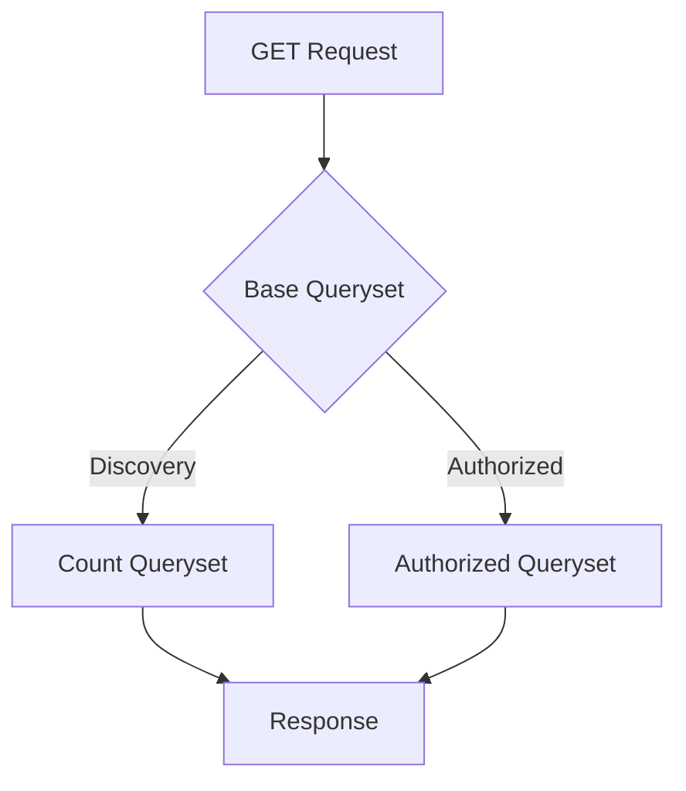

# Katsu Marathon of Hope (MoH) Packets


[](https://codecov.io/gh/CanDIG/katsu)

## Table of Contents

- [Installation Guide](#installation-guide) <!-- omit in toc -->
- [Tests](#tests)
- [Authentication and Authorization](#authentication-and-authorization)
- [REST API](#rest-api)

## Installation Guide

This guide will walk you through the steps to insctall and run Katsu on your local machine.

NOTE: If you want to run as docker container, please refer to the [docker guide](https://github.com/CanDIG/CanDIGv2/blob/develop/docs/install-docker.md)

### Prerequisites

Before you start, make sure you have the following installed on your machine:

- Python 3.8 or later
- PostgreSQL

### Step 1: Clone the repository

First, clone the repository to the folder where you want to install:

```bash
git clone https://github.com/CanDIG/katsu.git
```

### Step 2: Create a virtual environment (optional)

It's a good idea to create a virtual environment for your Django project, to keep your dependencies separate from other Python projects on your machine:

```bash
# Linux
sudo apt-get install python3-venv    # If needed
python3 -m venv .venv
source .venv/bin/activate

# macOS
python3 -m venv .venv
source .venv/bin/activate

# Windows
py -3 -m venv .venv
.venv\scripts\activate
```

### Step 3: Install dependencies

With your virtual environment activated, navigate to the project directory and install the project dependencies:

```bash
pip install -r requirements-candig-dev.txt
```

This will install all the packages listed in the requirements.txt file.

### Step 4: Set up the PostgreSQL database

Replace "dbname", "username", and "password" with the value in [local.py](config/settings/local.py):

```sql
sudo -u postgres psql
CREATE DATABASE dbname;
CREATE USER username WITH PASSWORD 'password';
GRANT ALL PRIVILEGES ON DATABASE dbname TO username;
```

### Step 5: Set up the database

With the database configured, run the following command to create the necessary database tables:

```bash
python manage.py migrate
```

### Step 6: Run the development server

Start the server with the following command:

```bash
python manage.py runserver
```

This will start the development server on port 8000. You can access the server by opening a web browser and navigating to <http://localhost:8000>

### Step 7: Ingest some data (optional)

Mock data are available [here](chord_metadata_service/mohpackets/data/README.md)

## Tests

Run all tests and linting checks for the whole project:

```bash
tox -c tox-candig.ini
```

Run all tests for mohpackets:

```bash
python manage.py test chord_metadata_service.mohpackets
```

Run each test:

```bash
python manage.py test chord_metadata_service.mohpackets.tests.<test_name>
```

Test and create `coverage` HTML report:

```bash
tox -c tox-candig.ini
coverage html
```

## Authentication and Authorization

Katsu uses Tyk for authentication and OPA for authorization. The following diagram illustrates the flow of requests and responses:


Inside Katsu, the flow of the request/response can be broken down into the following steps:

- Base Queryset: receives the GET request and generates a base queryset.

- Discovery: counts the patients that matches the criteria.

- Authorized: passes the request to OPA, which returns authorized datasets. Katsu then use it to generate only authorized data.



## REST API

You can find the schema documentation [here](chord_metadata_service/mohpackets/docs/README.md)
