# Small dataset relationships

This is a diagram of the synthetic relationships between the models in the dataset.

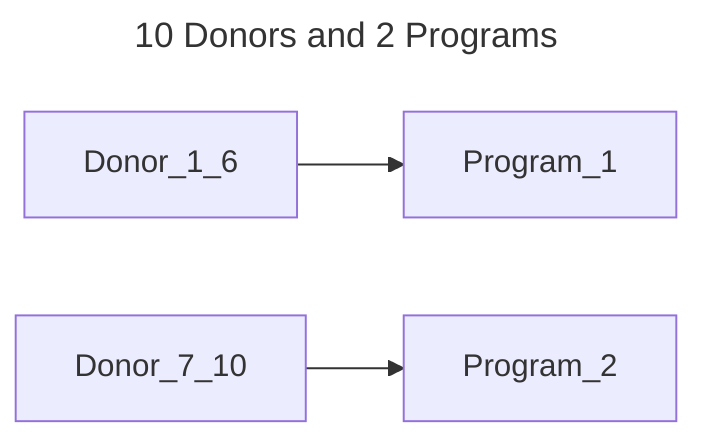

---

---

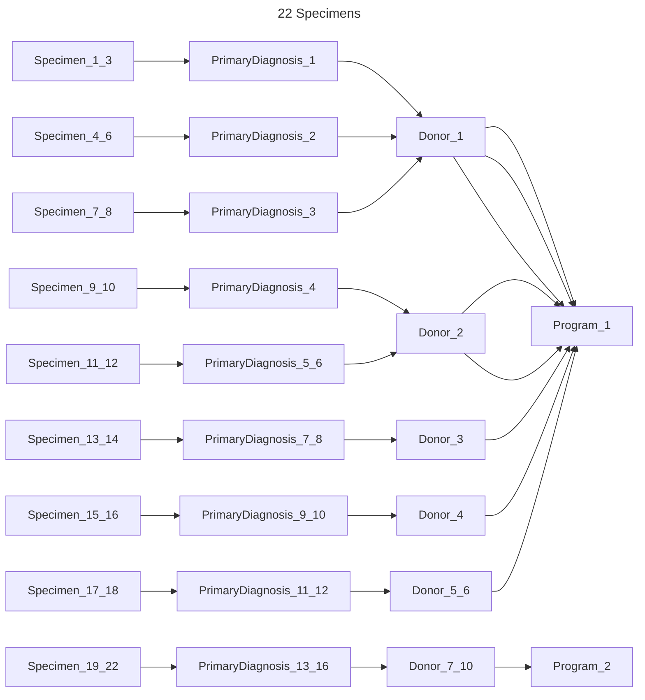

---

---

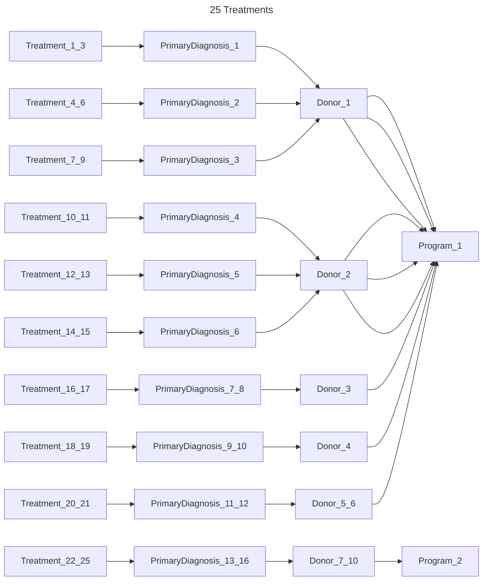

---

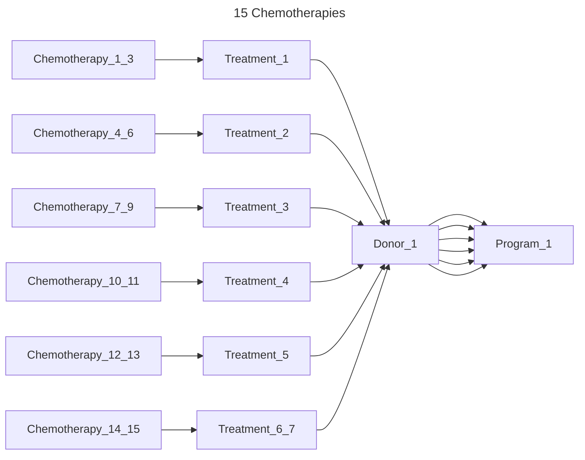

---

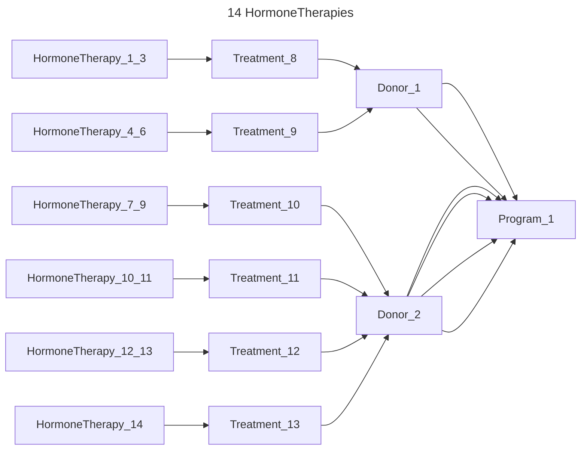

---

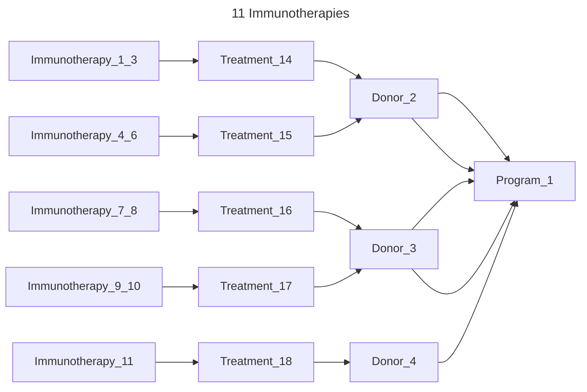

---

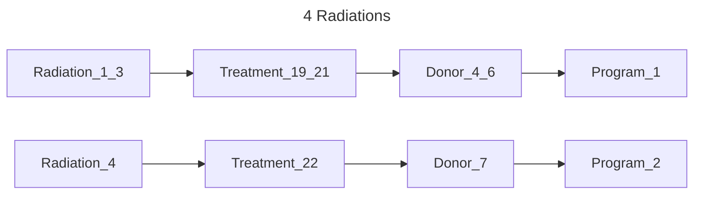

---

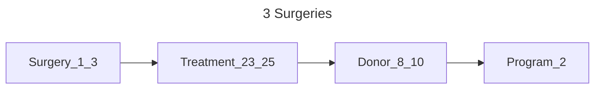

---

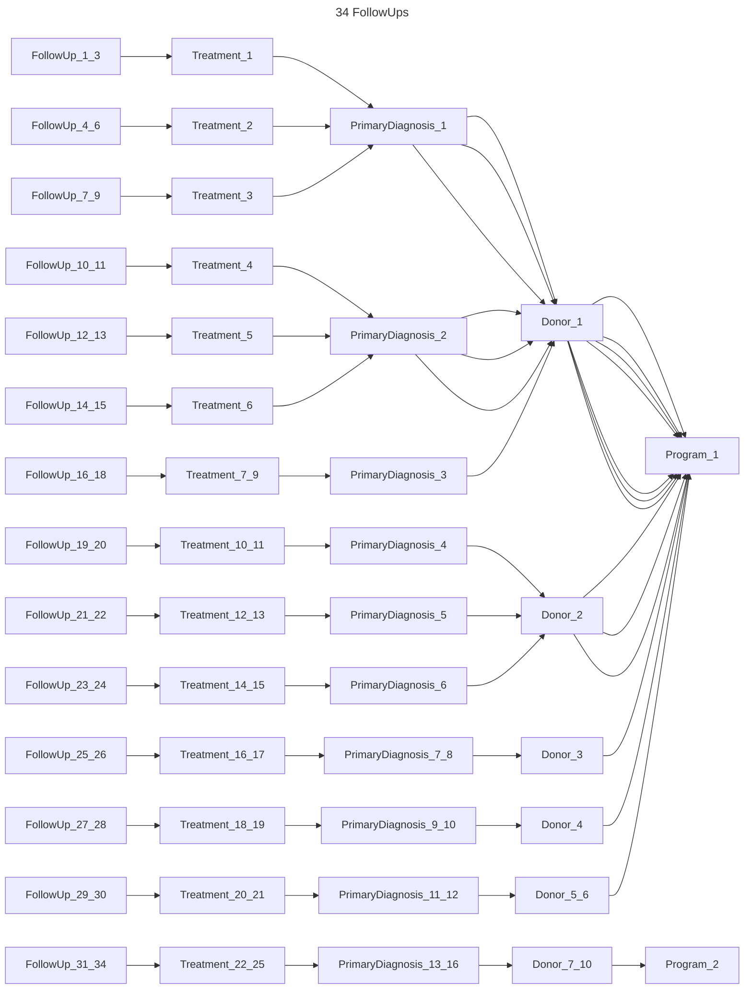

---

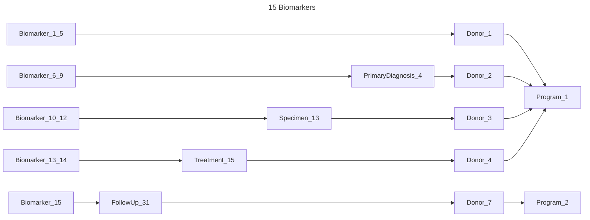

---

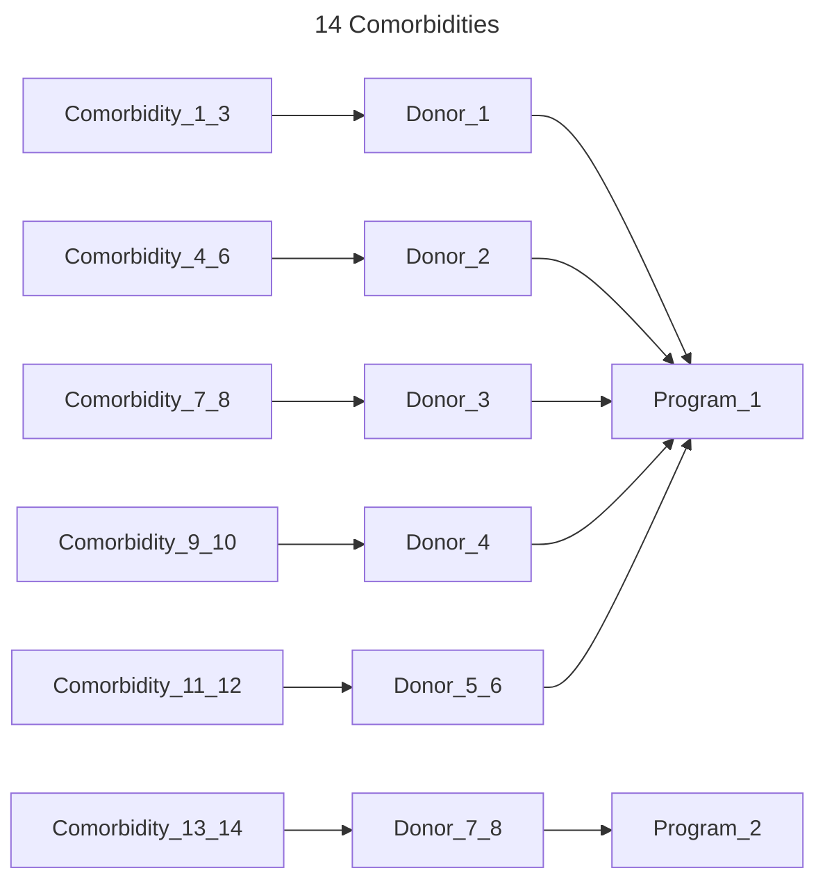

---

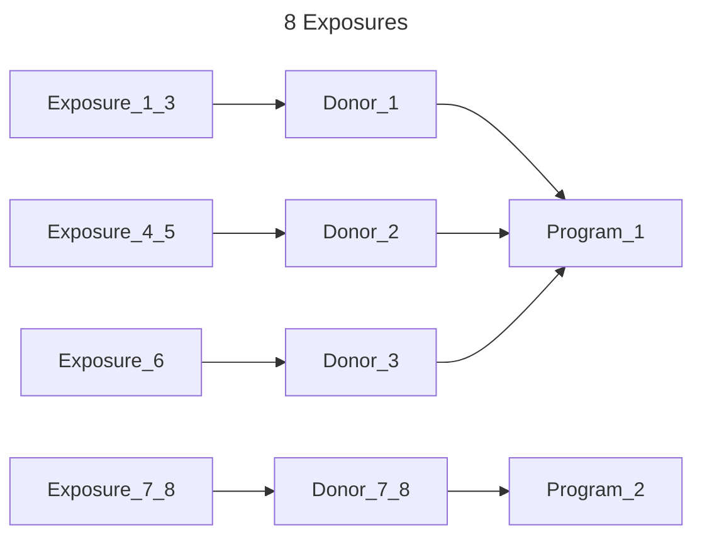
