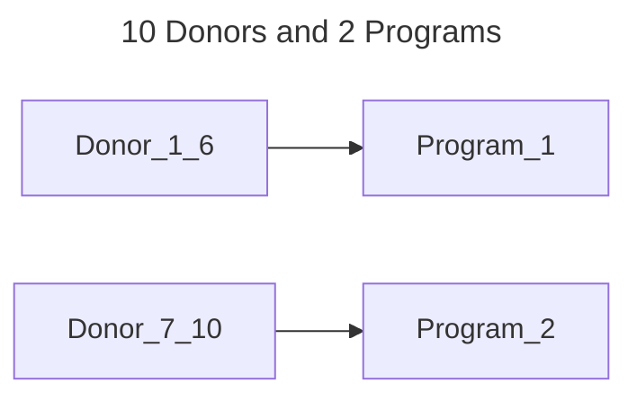
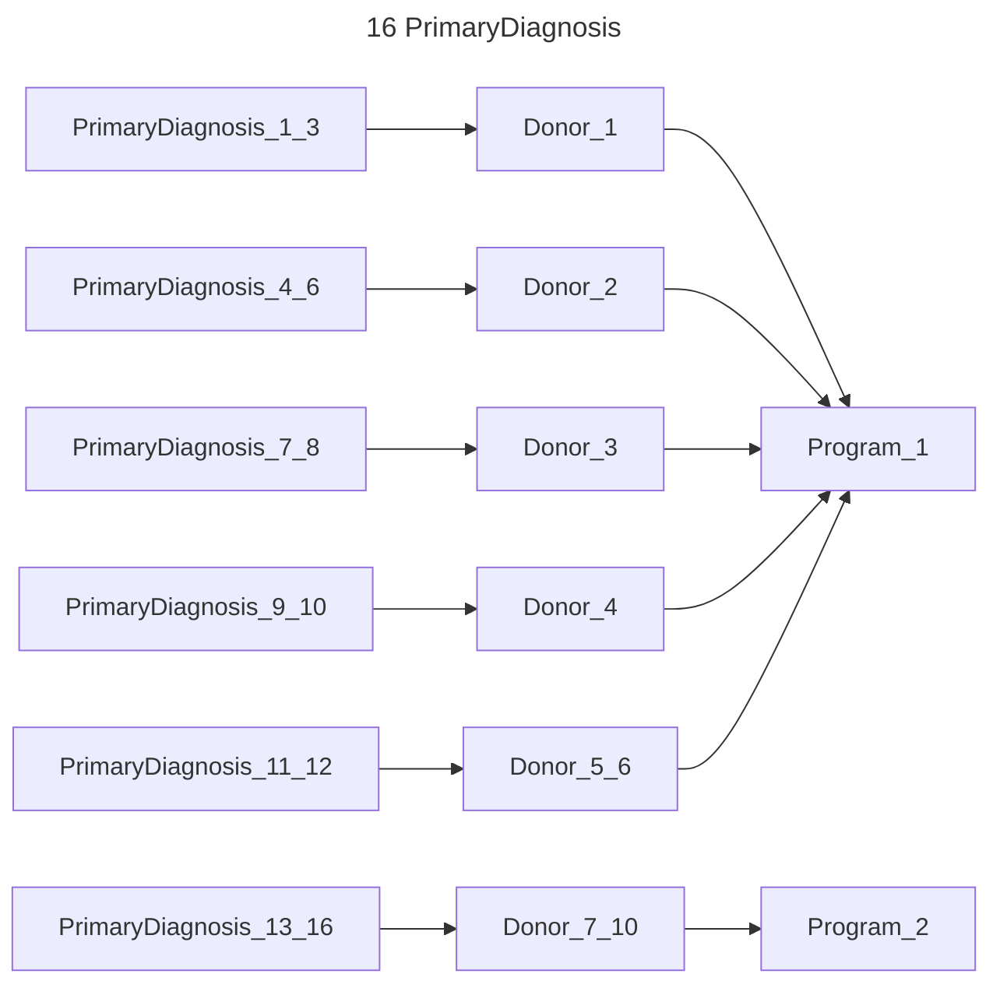
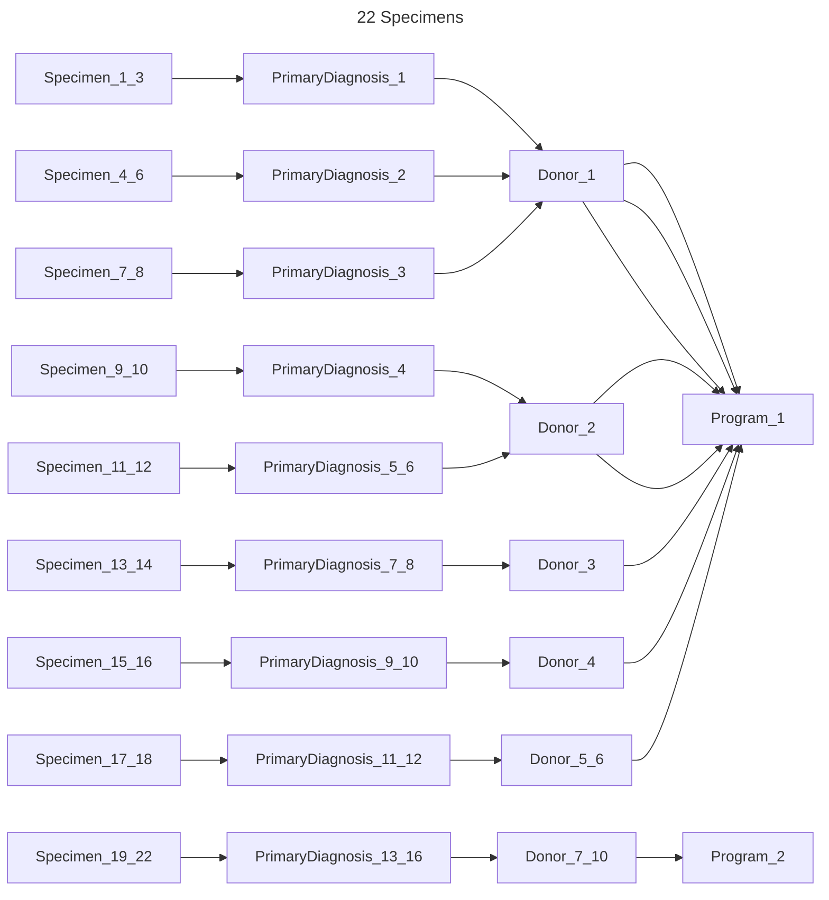
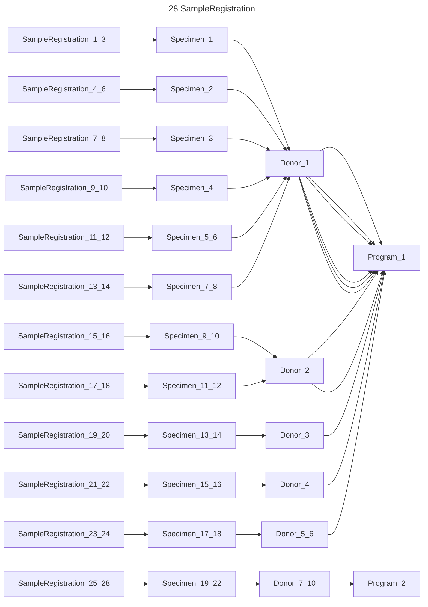
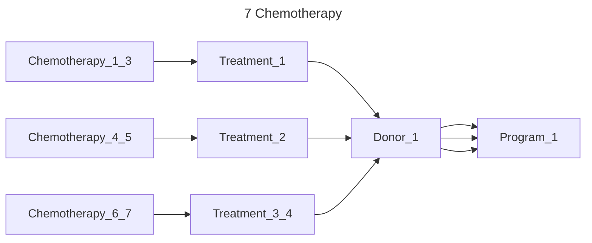
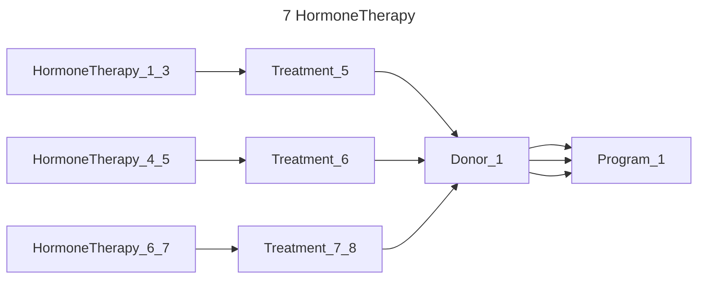
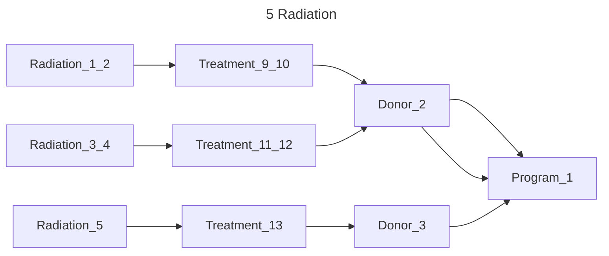
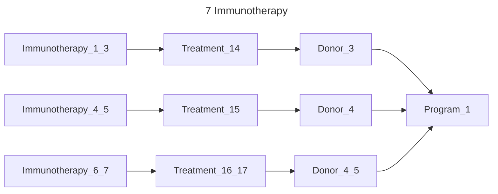
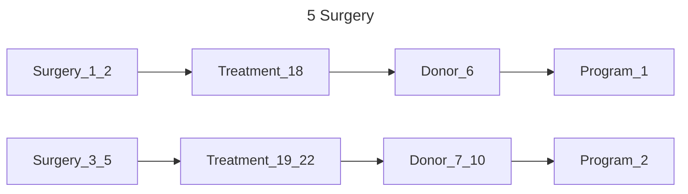
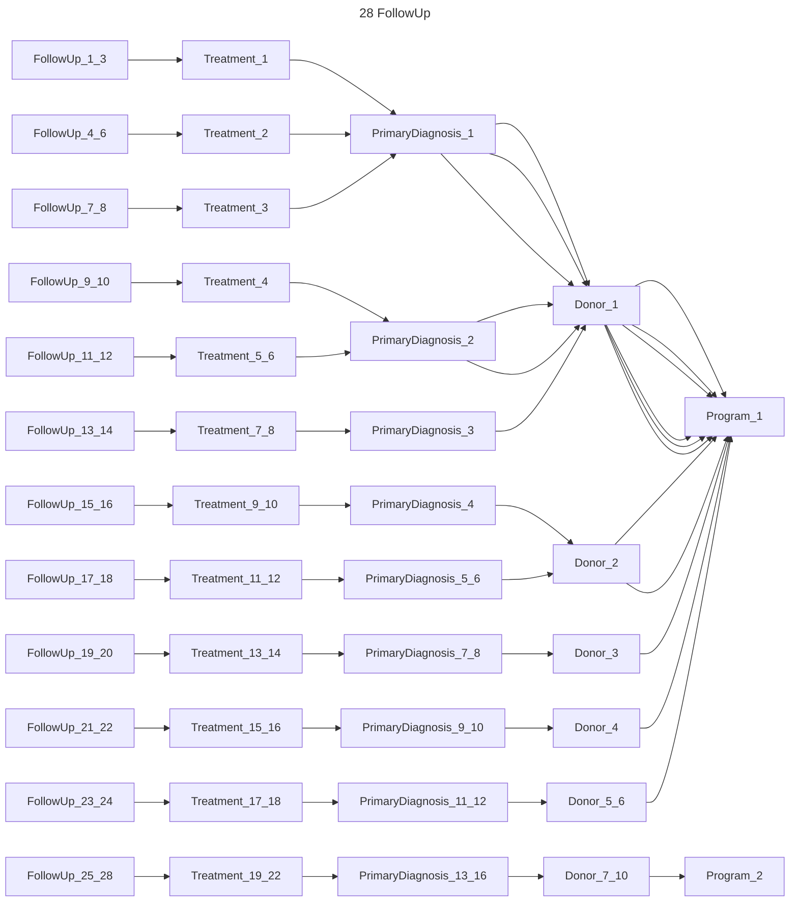

# Dataset relationships

This is a diagram of the relationships between the models in the dataset.

## Small dataset data

- 2 Programs
- 10 Donors
  - 1-6: program_1
  - 7-10: program_2

- 16 PrimaryDiagnosis
  - 1-3: donor_1 | program_1
  - 4-6: donor_2 | program_1
  - 7-8: donor_3 | program_1
  - 9-10: donor_4 | program_1
  - 11-12: donor_5_6 | program_1
  - 13-16: donor_7_10 | program_2

- 22 Specimen
  - 1-3: primary_diagnosis_1 | donor_1 | program_1
  - 4-6: primary_diagnosis_2 | donor_1 | program_1
  - 7-8: primary_diagnosis_3 | donor_1 | program_1
  - 9-10: primary_diagnosis_4 | donor_2 | program_1
  - 11-12: primary_diagnosis_5_6 | donor_2 | program_1
  - 13-14: primary_diagnosis_7_8 | donor_3 | program_1
  - 15-16: primary_diagnosis_9_10 | donor_4 | program_1
  - 17-18: primary_diagnosis_11_12 | donor_5_6 | program_1
  - 19-22: primary_diagnosis_13_16 | donor_7_10 | program_2

- 28 SampleRegistration
  - 1-3: specimen_1 | donor_1 | program_1
  - 4-6: specimen_2 | donor_1 | program_1
  - 7-8: specimen_3 | donor_1 | program_1
  - 9-10: specimen_4 | donor_1 | program_1
  - 11-12: specimen_5_6 | donor_1 | program_1
  - 13-14: specimen_7_8 | donor_1 | program_1
  - 15-16: specimen_9_10 | donor_2 | program_1
  - 17-18: specimen_11_12 | donor_2 | program_1
  - 19-20: specimen_13_14 | donor_3 | program_1
  - 21-22: specimen_15_16 | donor_4 | program_1
  - 23-24: specimen_17_18 | donor_5_6 | program_1
  - 25-28: specimen_19_22 | donor_7_10 | program_2

- 22 Treatment
  - 1-3: primary_diagnosis_1 | donor_1 | program_1
  - 4-6: primary_diagnosis_2 | donor_1 | program_1
  - 7-8: primary_diagnosis_3 | donor_1 | program_1
  - 9-10: primary_diagnosis_4 | donor_2 | program_1
  - 11-12: primary_diagnosis_5_6 | donor_2 | program_1
  - 13-14: primary_diagnosis_7_8 | donor_3 | program_1
  - 15-16: primary_diagnosis_9_10 | donor_4 | program_1
  - 17-18: primary_diagnosis_11_12 | donor_5_6 | program_1
  - 19-22: primary_diagnosis_13_16 | donor_7_10 | program_2

- 7 Chemotherapy
  - 1-3: treatment_1 | donor_1 | program_1
  - 4-5: treatment_2 | donor_1 | program_1
  - 6-7: treatment_3_4 | donor_1 | program_1

- 7 HormoneTherapy
  - 1-3: treatment_5 | donor_1 | program_1
  - 4-5: treatment_6 | donor_1 | program_1
  - 6-7: treatment_7_8 | donor_1 | program_1

- 5 Radiation
  - 1-2: treatment_9_10 | donor_2 | program_1
  - 3-4: treatment_11_12 | donor_2 | program_1
  - 5: treatment_13 | donor_3 | program_1

- 7 Immunotherapy
  - 1-3: treatment_14 | donor_3 | program_1
  - 4-5: treatment_15 | donor_4 | program_1
  - 6-7: treatment_16_17 | donor_4_5 | program_1

- 5 Surgery
  - 1: treatment_18 | specimen_18 | donor_6 | program_1
  - 2-5: treatment_19_22 | donor_7_10 | program_2

- 28 FollowUp
  - 1-3: treatment_1 | primary_diagnosis_1 | donor_1 | program_1
  - 4-6: treatment_2 | primary_diagnosis_1 | donor_1 | program_1
  - 7-8: treatment_3 | primary_diagnosis_1 | donor_1 | program_1
  - 9-10: treatment_4 | primary_diagnosis_2 | donor_1 | program_1
  - 11-12: treatment_5_6 | primary_diagnosis_2 | donor_1 | program_1
  - 13-14: treatment_7_8 | primary_diagnosis_3 | donor_1 | program_1
  - 15-16: treatment_9_10 | primary_diagnosis_4 | donor_2 | program_1
  - 17-18: treatment_11_12 | primary_diagnosis_5_6 | donor_2 | program_1
  - 19-20: treatment_13_14: primary_diagnosis_7_8 | donor_3 | program_1
  - 21-22: treatment_15_16: primary_diagnosis_9_10 | donor_4 | program_1
  - 23-24: treatment_17_18: primary_diagnosis_11_12 | donor_5_6 | program_1
  - 25-28: treatment_19_22: primary_diagnosis_13_16 | donor_7_10 | program_2

- 12 Biomarker
  - 1-3: follow_up_1 | specimen_1 | donor_1 | program_1
  - 4-6: follow_up_2 | donor_1 | program_1
  - 7-8: specimen_1 | treatment_1 | donor_1 | program_1
  - 9-10: treatment_2 | donor_1 | program_1
  - 11-11: primary_diagnosis_4 | donor_2 | program_1
  - 12-12: donor_3 | program_1

- 14 Comorbidity
  - 1-3: donor_1 | program_1
  - 4-6: donor_2 | program_1
  - 7-8: donor_3 | program_1
  - 9-10: donor_4 | program_1
  - 11-12: donor_5_6 | program_1
  - 13-14: donor_7_8 | program_2

