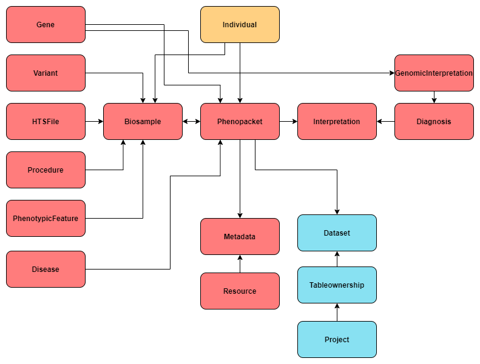

Introduction
============

Metadata service is a service to store phenotypic and clinical metadata about the patient and/or biosample.
Data model is partly based on `GA4GH Phenopackets schema <https://github.com/phenopackets/phenopacket-schema>`_.

The simplified data model of the service is below.

Architecture
------------

Metadata Service contains several services that share one API.
Services depend on each other and separated based on their scope.

**1. Patients service** handles anonymized individual’s data (e.g. individual id, sex, age or date of birth)

- Data model: aggregated profile from GA4GH Phenopackets Individual and FHIR Patient. Contains all fields of Phenopacket Individual and additional fields from FHIR Patient.

**2. Phenopackets service** handles phenotypic and clinical data

- Data model: GA4GH Phenopackets schema. Currently contains only two out of four Phenopackets top elements - Phenopacket and Interpretation.

**3. CHORD service** handles granular metadata about dataset (e.g. description, where the dataset is located, who are the creators of the dataset, licenses applied to the dataset,
authorization policy,terms of use).
The dataset in current implementation is one or more phenopackets related to each other through their provenance.

- Underlying Data model:
    - DATS model used for dataset description;
    - GA4GH DUO is used to capture the terms of use applied to a dataset.

**4. Restapi service** handles all generic functionality shared among other services (e.g. renderers, common serializers, schemas, validators)

Technical implementation
------------------------

The service is implemented in Python and Django and uses PostgreSQL database to store the data.
Besides PostgreSQL the data can be indexed in Elasticsearch. Currently data in elasticsearch is indexed in FHIR format.

